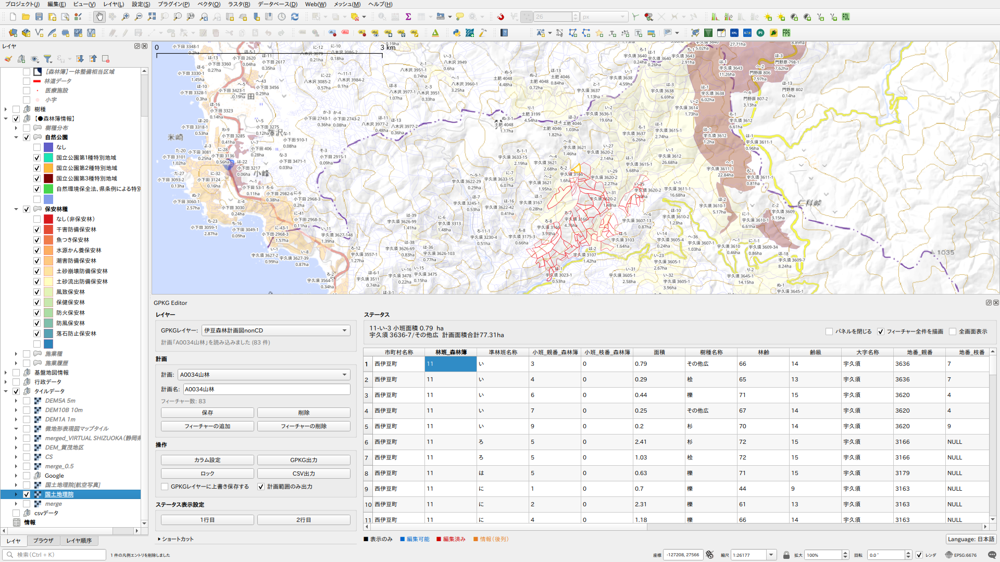

# GPKG Editor

A QGIS plugin for viewing and editing GeoPackage (GPKG) layer attributes with plan management and export support.



## Features

- **Attribute table**: Select features on the map and view/edit their attributes in a table
- **Non-destructive edits**: Edits are stored in a separate SQLite file (`{name}_data.sqlite`), leaving the original GPKG untouched
- **Plan management**: Save named plans (feature sets + column configurations) and restore them later
- **Feature management**: Add or remove features from the active plan
- **Status display**: Define expression-based status rows to show computed values for the selected row
- **Export**: Export the merged result (original + edits) as GPKG or CSV
- **Lock mode**: Freeze the map canvas to prevent accidental panning while keeping selection tools active. While locked, table row selection highlights features in place without moving the canvas, allowing spatial comparison within a fixed view
- **Map thumbnail**: Visual overview of the current plan's features. Mutually exclusive with the Shortcuts panel

## Column modes

Each column can be set to one of four modes in the column configuration dialog:

| Mode | Description |
|------|-------------|
| Hidden (非表示) | Not shown in the table |
| Display (表示のみ) | Shown read-only |
| Editable (表示＋編集) | Shown and editable |
| Info (情報) | Shown read-only, always placed after Display and Editable columns (rear columns) |

The **Info** mode is intended for reference columns that you want to keep visually separated from the main working columns.
Columns appear in this order: Display → Editable → Info.

## Status expression syntax

Status rows support a QGIS-expression-like syntax:

```
"column_name"          Column reference (selected row value)
'text'                 String literal
||                     String concatenation
=, !=, >, <, >=, <=   Comparison
+, -, *, /             Arithmetic
if(cond, true, false)  Conditional
round(value[, digits]) Rounding

Aggregate functions (applied to all rows):
  count()       Row count
  count(expr)   Count where expr is truthy
  sum("COL")    Numeric sum
  min("COL")    Minimum value
  max("COL")    Maximum value
  unique("COL") Count of unique values
```

## Keyboard shortcuts

| Shortcut | Action |
|----------|--------|
| Ctrl+C | Copy selected cells (tab-separated) |
| Ctrl+V | Paste clipboard to selected cells |
| Shift+Scroll | Horizontal scroll |
| Ctrl+Arrow | Move to end cell |
| Ctrl+Shift+Arrow | Select to end cell |
| Enter | Toggle edit mode for current cell |

## Lock mode

Enabling lock mode freezes the map canvas — pan and zoom are disabled, but selection tools remain active. Table row selection highlights the corresponding feature (crosshair marker for point layers; rubber band for line/polygon layers), but the canvas does not pan to follow. This lets you browse the attribute table and compare features within a fixed spatial view.

A **Lock** checkbox is also available in the status bar alongside the panel-close and fullscreen toggles.

## Planned Features

### Attribute Edit History
Track how each feature's attributes have changed over time. Every edit is recorded with the previous value, new value, plan name, and timestamp. A history view will be available alongside the attribute table, making it possible to review changes per feature — useful for annual updates to agricultural fields, timber volume tracking in forestry, or road maintenance records.

フィーチャーごとの属性編集履歴を記録・照会する機能です。農地の年次更新、山林の材積推移、林道の補修記録などの用途を想定しています。

## Requirements

- QGIS 3.16 or later

## License

This plugin is distributed under the GNU General Public License v2 or later.
See [LICENSE](LICENSE) for details.

## Support

If this plugin is helpful for your work, you can support the development here:
https://paypal.me/rawslnc

## Author

(C) 2026 por Hideharu Masai